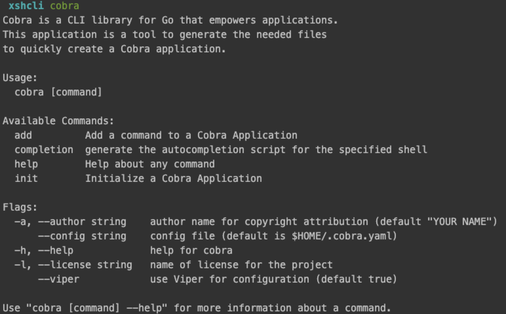
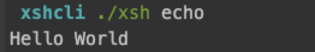
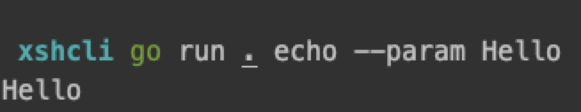

### 基于

基于 kratos main 分支，最新 commit id 为：79057d4326a64818be7cda41444cc331436b48f5


### 使用 Cobra 构建自己的命令行工具

kratos 是一个轻量级的微服务框架，其经过精心设计的源码值得我们深入阅读、理解，kratos 提供了一套 cli 命令工具来创建、运行项目，我想先从 kratos 的 cli 工具开始，看看这些命令时如何实现的。

在开始阅读 kratos cli 源码之前，先要了解 go 中辅助构建命令的工具：cobra，感兴趣的可以直接自己去 github 仓库查看其使用方法：github.com/spf13/cobra，利用 cobra 我们可以很方便的用 golang 代码实现一个命令行 cli 工具，接下来看一下如何使用。

首先按照仓库提示，安装 cobra

```shell
go get -u github.com/spf13/cobra
```

安装正确的话，在终端输入 cobra 会弹出如下信息：



cobra 安装完毕，初始化我们自己的 cli 的 golang 项目：

```shell
mkdir xshcli
cd xshcli
go mod init github.com/ForgetAll/xsh/cli
mkdir cmd
```

如果是 windows 用户，mkdir 替换成创建目录 = =

创建 cmd 目录是因为使用 cobra 命令生成代码默认是生成在 cmd 目录的，而且也比较符合 go 工程目录的命名习惯。接下来我们利用 cobra 创建一个 echo 命令，其功能就是输出伟大的`Hello World`，执行如下命令：

```shell
cobra add echo
```

会在 cmd 目录生成如下代码：

```go

package cmd

import (
	"fmt"

	"github.com/spf13/cobra"
)

// echoCmd represents the echo command
var echoCmd = &cobra.Command{
	Use:   "echo",
	Short: "A brief description of your command",
	Long: `A longer description that spans multiple lines and likely contains examples
and usage of using your command. For example:

Cobra is a CLI library for Go that empowers applications.
This application is a tool to generate the needed files
to quickly create a Cobra application.`,
	Run: func(cmd *cobra.Command, args []string) {
		fmt.Println("echo called")
	},
}

func init() {
	rootCmd.AddCommand(echoCmd)

	// Here you will define your flags and configuration settings.

	// Cobra supports Persistent Flags which will work for this command
	// and all subcommands, e.g.:
	// echoCmd.PersistentFlags().String("foo", "", "A help for foo")

	// Cobra supports local flags which will only run when this command
	// is called directly, e.g.:
	// echoCmd.Flags().BoolP("toggle", "t", false, "Help message for toggle")
}
```

这里会报错，因为目前项目里还没有 rootCmd，在 cmd 中创建一个就完事了：

```go
package cmd

import "github.com/spf13/cobra"

var rootCmd = &cobra.Command{
	Use:   "xsh",
	Short: "A generator for xsh based applications",
	Long:  "A generator for xsh based applications",
}

func Execute() error {
	return rootCmd.Execute()
}

func init() {
	cobra.OnInitialize(initConfig)
	rootCmd.AddCommand(echoCmd)
}

func initConfig() {

}
```

在项目根目录添加 main.go：

```shell
package main

import "github.com/ForgetAll/xsh/cli/cmd"

func main() {
	cmd.Execute()
}
```

这里 cmd.Execute() 是有返回 error 值的，在 go 的约定中，error 是一定要检查的，但是这里通常是因为用户输入的参数错误导致的，如果有必要收集错误信息可以加一些日志输出操作。

最后再实现一下我们的 echoCmd：

```go
package cmd

import (
	"fmt"

	"github.com/spf13/cobra"
)

// echoCmd represents the echo command
var echoCmd = &cobra.Command{
	Use:   "echo",
	Short: "test cobra",
	Long:  `test cobra`,
	Run: func(cmd *cobra.Command, args []string) {
		fmt.Println("Hello World")
	},
}
直接
```

直接执行以下命令：

```shell
go run . echo
```

就会输出 Hello World，那么如何像 kratos 一样用帅气酷炫的自己命名的 cli 呢？

很简单，直接构建出可执行程序并指定输出文件名……

```shell
go build -o xsh main.go
```

然后执行：



如果想要 xsh 全局可用，可以直接将其配置到环境变量或者直接将生成的可执行文件放到之前配置过的任何一个环境变量目录下即可。可以放到 GOPATH 的 bin 目录下，在该目录下你可以发现我们所使用的 cobra、kratos 等命令程序。

如果想要更进一步，比如指定参数，比如 kratos 中初始化项目，因为众所周知的原因，拉取 github 仓库可能会失败，可以指定国内的模板仓库。这里我们也想打印指定的参数，该如何获取？

```go
package cmd

import (
	"fmt"

	"github.com/spf13/cobra"
)

var echoParam string

// echoCmd represents the echo command
var echoCmd = &cobra.Command{
	Use:   "echo",
	Short: "test cobra",
	Long:  `test cobra`,
	Run: func(cmd *cobra.Command, args []string) {
		fmt.Println(echoParam)
	},
}

func init() {
	echoCmd.PersistentFlags().StringVar(&echoParam, "param", "", "use this param to echo")
}

```



如此一来，就可以使用 --param 来指定输出的参数了。

关于 cobra 的介绍就到此位置了，感兴趣的小伙伴可以阅读官方文档整更多的花活：

https://github.com/spf13/cobra/blob/master/user_guide.md

接下来便看看 kratos 中的 cli 工具实现。


### Kratos Cli


